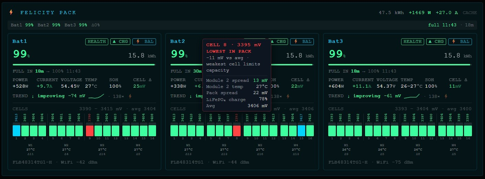
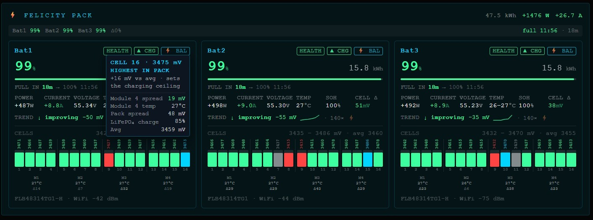
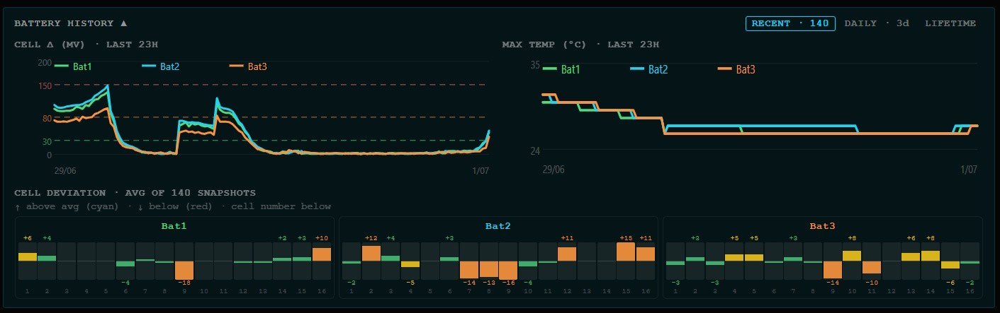

# mcp-fsolar

Live Felicity Solar battery data for Claude, REST APIs, Node.js apps, and event-driven pipelines — all from one package.

Connects to the [Felicity Solar](https://www.felicitysolar.com) cloud (`shine-api.felicitysolar.com`) and exposes per-cell voltages, SOC, SOH, temperatures, BMS counters, balancing state, and computed health metrics.

## Usage modes

| Mode | When to use |
|---|---|
| [MCP server → Claude](#mcp-server--claude) | Ask Claude natural-language questions about your batteries |
| [Standalone REST API](#standalone-rest-api) | Query battery data over HTTP from any language or tool |
| [JS / TS library](#js--ts-library) | Embed directly in a Node.js or Next.js app — no separate server |
| [Event-driven](#event-driven-webhooks--emitter) | React to battery events (alerts, periodic snapshots) via webhooks or EventEmitter |

---

## MCP server → Claude

The same `fsolar-mcp` process serves both MCP and REST from one port.

### Claude Code (CLI)

Start the server manually, then register it:

```bash
npm install -g fsolar-mcp
FELICITY_USER=you@example.com FELICITY_PASS=yourpass fsolar-mcp
```

```bash
claude mcp add felicity --transport sse http://localhost:3010/sse
```

Or let Claude Code **auto-launch** it on demand — no separate terminal needed. Run once to register:

```bash
claude mcp add felicity \
  -e FELICITY_USER=you@example.com \
  -e FELICITY_PASS=yourpass \
  -- npx fsolar-mcp
```

> **Credentials tip:** the `-e KEY=val` flags appear in shell history. To avoid that, store credentials in `.env` and use the JSON config approach (Claude Desktop / Cursor sections below) — credentials stay in the config file, not the command line.

Claude Code launches a fresh `fsolar-mcp` process for each session (via stdio) and kills it when done. Each process starts its own poller, so `get_balance_trend` needs ~10 min of uptime before trend data is available.

Ask Claude things like *"what's the battery SOC?"*, *"is any cell imbalanced?"*, or *"show me the cell voltages for Bat2"*.

### Claude Desktop

Open Claude Desktop → Settings → Developer → Edit Config and add:

- **macOS**: `~/Library/Application Support/Claude/claude_desktop_config.json`
- **Windows**: `%APPDATA%\Claude\claude_desktop_config.json`

```json
{
  "mcpServers": {
    "felicity": {
      "command": "npx",
      "args": ["fsolar-mcp"],
      "env": {
        "FELICITY_USER": "your@example.com",
        "FELICITY_PASS": "yourpassword"
      }
    }
  }
}
```

Restart Claude Desktop — a hammer icon appears in the toolbar when the server is connected.

### Cursor

Add to `.cursor/mcp.json` in your project root (or the global `~/.cursor/mcp.json`):

```json
{
  "mcpServers": {
    "felicity": {
      "command": "npx",
      "args": ["fsolar-mcp"],
      "env": {
        "FELICITY_USER": "your@example.com",
        "FELICITY_PASS": "yourpassword"
      }
    }
  }
}
```

### Any MCP client (SSE transport)

Start the server, then point your client at the SSE endpoint:

```
http://localhost:3010/sse
```

The MCP message endpoint is `http://localhost:3010/messages?sessionId=<id>` (handled automatically by the SDK).

### MCP tools

| Tool | Description |
|---|---|
| `get_all_batteries` | Live status of all batteries — SOC, power, voltage, temperature, charging state |
| `get_battery` | Detailed status of one battery by alias (`Bat1`) or serial number |
| `get_cell_voltages` | Individual cell voltages (mV) — useful for detecting cell imbalance |
| `get_fleet_summary` | Compact health summary: total energy, worst cell delta, temperatures |
| `get_balance_trend` | Cell delta trend over the last ~60 min (improving / stable / degrading) |
| `get_snapshots` | Raw snapshots for the last ~60 min (one per ~10 min) |

---

## Standalone REST API

The same `fsolar-mcp` process exposes a plain HTTP API on the same port. No MCP client needed — any language or tool that can make HTTP requests works.

```bash
npm install -g fsolar-mcp
FELICITY_USER=you@example.com FELICITY_PASS=yourpass fsolar-mcp
```

### Endpoint reference

| Method | Path | Description |
|---|---|---|
| `GET` | `/batteries` | All batteries — SOC, power, voltage, temperature, charging state |
| `GET` | `/batteries/:id` | One battery by alias (`Bat1`) or serial number |
| `GET` | `/snapshots/intraday` | Download intraday snapshot store (JSON file) |
| `GET` | `/snapshots/daily` | Download daily snapshot store (JSON file) |
| `GET` | `/snapshots/state` | Download latest persisted state (JSON file) |
| `DELETE` | `/snapshots/intraday` | Clear intraday snapshot history |
| `DELETE` | `/snapshots/daily` | Clear daily snapshot history |
| `DELETE` | `/snapshots/all` | Clear all snapshot stores |
| `POST` | `/hooks` | Register a webhook URL |
| `GET` | `/hooks` | List registered webhooks |
| `DELETE` | `/hooks/:id` | Remove a webhook |
| `GET` | `/sse` | MCP SSE endpoint |

### Examples

```bash
# all batteries
curl http://localhost:3010/batteries

# one battery
curl http://localhost:3010/batteries/Bat1

# download snapshot history for analysis
curl http://localhost:3010/snapshots/intraday -o intraday.json
curl http://localhost:3010/snapshots/daily    -o daily.json

# register a webhook for all events
curl -X POST http://localhost:3010/hooks \
  -H 'Content-Type: application/json' \
  -d '{"url": "https://your-server.com/webhook"}'
```

**`GET /batteries` response shape:**

```json
{
  "batteries": [
    {
      "alias": "Bat1",
      "soc": 87,
      "soh": 98,
      "chargingState": "charging",
      "power": 1240,
      "voltage": 53.2,
      "current": 23.3,
      "cellDelta": 12,
      "tempMin": 28,
      "tempMax": 31,
      "remainingKwh": 8.7,
      "isBalancing": false,
      "cellVoltages": [3310, 3312, 3308, "…16 cells total"]
    }
  ],
  "fetchedAt": "2025-06-01T12:00:00.000Z",
  "fromCache": true,
  "pollError": null
}
```

**`GET /batteries/:id` response shape:**

```json
{
  "battery": { "…full battery object including modules…" },
  "fetchedAt": "2025-06-01T12:00:00.000Z",
  "fromCache": true
}
```

Pass `X-Last-Fetched-At: <ISO timestamp>` to bypass the cache when you already hold fresh data.

---

## JS / TS library

Import the client directly in your app — no separate server or network hop required. The library handles RSA login, token refresh, and caching internally.

```js
import { FelicityClient, MemoryCacheAdapter } from 'fsolar-mcp'

const client = new FelicityClient({
  user: process.env.FELICITY_USER,
  pass: process.env.FELICITY_PASS,
  cache: new MemoryCacheAdapter(),
  ttl: 30,  // cache TTL in seconds
})

const { batteries } = await client.getBatteries()
const { battery }   = await client.getBattery('Bat1')
```

To also start the background poller (keeps data fresh, enables snapshots and events):

```js
import { FelicityClient, MemoryCacheAdapter, startPoller } from 'fsolar-mcp'

const client = new FelicityClient({ user, pass, cache: new MemoryCacheAdapter(), ttl: 30 })
startPoller(client)   // polls every FELICITY_POLL_MS (default 30 s)
```

Full TypeScript types are in `index.d.ts`.

---

## Event-driven: webhooks & emitter

React to battery state changes without polling. Two delivery mechanisms — use one or both.

### HTTP webhooks

Register a URL to receive POST requests when events fire:

```
POST /hooks         body: { url, events? }   # register
GET  /hooks         # list registered hooks
DELETE /hooks/:id   # remove a hook
```

```bash
# receive all events
curl -X POST http://localhost:3010/hooks \
  -H 'Content-Type: application/json' \
  -d '{"url": "https://your-server.com/webhook"}'

# receive only critical cell alerts and periodic snapshots
curl -X POST http://localhost:3010/hooks \
  -H 'Content-Type: application/json' \
  -d '{"url": "https://your-server.com/webhook", "events": ["cell_delta_crit", "snapshot"]}'
```

### EventEmitter (same-process)

Subscribe directly in Node.js without an HTTP round-trip:

```js
import { startPoller, snapshotEmitter } from 'fsolar-mcp'

snapshotEmitter.on('snapshot', ({ batteries, health, ts }) => {
  // fires every FELICITY_TELEMETRY_MS (default 5 min)
  console.log(batteries[0].soc, health)
})

startPoller(client)
```

### Hook events

| Event | Trigger | Cooldown |
|---|---|---|
| `cell_delta_crit` | Cell delta ≥ 150 mV | 30 min |
| `cell_delta_warn` | Cell delta ≥ 80 mV | 30 min |
| `temp_crit` | Any cell ≥ 45 °C | 30 min |
| `temp_warn` | Any cell ≥ 40 °C | 30 min |
| `soh_warn` | SOH < 80 % | 60 min |
| `low_soc` | SOC ≤ 10 % | 60 min |
| `full` | SOC reaches 100 % | — |
| `online` | Battery comes online | — |
| `offline` | Battery goes offline | — |
| `snapshot` | Time-based (every `FELICITY_TELEMETRY_MS`) | none |

---

## Configuration

| Variable | Required | Default | Description |
|---|---|---|---|
| `FELICITY_USER` | Yes | — | Felicity Solar account email |
| `FELICITY_PASS` | Yes | — | Felicity Solar account password |
| `FELICITY_PORT` | No | `3010` | HTTP server port |
| `FELICITY_API_KEY` | No | — | If set, all REST requests must supply `Authorization: Bearer <key>` or `X-API-Key: <key>` |
| `FELICITY_CORS_ORIGIN` | No | localhost origins only | Allowed CORS origin. Set to `*` to open fully, or an explicit origin to lock down |
| `FELICITY_RATE_LIMIT` | No | `60` | Max REST requests per minute per IP. Set to `0` to disable |
| `FELICITY_POLL_MS` | No | `30000` | Felicity API poll interval (ms) |
| `FELICITY_TELEMETRY_MS` | No | `300000` | Snapshot emitter / webhook interval (ms) |
| `FELICITY_SNAPSHOT_ENABLED` | No | `true` | Enable background snapshot store |
| `FELICITY_SNAPSHOT_MS` | No | `600000` | Snapshot store interval (ms, min 60 000) |
| `FELICITY_SNAPSHOT_DAYS` | No | `3` | Intra-day snapshot retention (days) |
| `FELICITY_DAILY_DAYS` | No | `90` | Daily snapshot retention (days) |
| `SNAPSHOT_DIR` | No | `os.tmpdir()` | Directory for snapshot JSON files (`battery-snapshots.json`, `battery-daily.json`, `battery-state.json`) |

---

## What you can build

**Real-time fleet view** — per-cell voltages, SOC, power flow, SOH, balancing state and temperature for every battery in the pack.



**Cell-level inspection** — voltage, deviation from pack average, module spread, LiFePO4 charge %, weakest/strongest cell.



**Historical trends** — cell-delta and temperature over the last 24 h, per-cell deviation heatmap, daily SOH trend, lifetime cycle-count with projected remaining battery life.



---

## Available data

### Per battery

| Field | Type | Description |
|---|---|---|
| `sn` | string | Serial number |
| `alias` | string | Human name (`Bat1`, `Bat2`, `Bat3`) |
| `model` | string | Model string from BMS |
| `status` | `NM` \| `AL` \| `FL` \| `OF` | Normal / Alarm / Fault / Offline |
| `soc` | number % | State of charge |
| `soh` | number % | State of health |
| `voltage` | number V | Pack voltage |
| `current` | number A | Pack current |
| `power` | number W | Pack power (positive = charging, negative = discharging) |
| `chargingState` | string | `charging` / `discharging` / `standby` |
| `remainingKwh` | number | Estimated remaining energy |
| `capacityAh` | number | Rated capacity (Ah) |
| `ratedEnergyKwh` | number \| null | Rated energy (kWh) |
| `isBalancing` | boolean | Active cell balancing in progress |
| `warningCount` | number | Active BMS warnings |

### Cell & temperature

| Field | Type | Description |
|---|---|---|
| `cellVoltages` | number[] mV | All 16 cell voltages |
| `cellVoltageMin` | number \| null mV | Lowest cell voltage |
| `cellVoltageMax` | number \| null mV | Highest cell voltage |
| `cellDelta` | number \| null mV | Spread between min and max cell (imbalance indicator) |
| `minCellNum` | number \| null | 1-based index of weakest cell |
| `maxCellNum` | number \| null | 1-based index of strongest cell |
| `cellTemps` | number[] °C | 4 physical temperature sensors |
| `tempMin` | number °C | Lowest sensor reading |
| `tempMax` | number °C | Highest sensor reading |

### BMS protection limits

| Field | Type | Description |
|---|---|---|
| `chargeVoltLimit` | number \| null V | Max charge voltage |
| `dischargeVoltLimit` | number \| null V | Min discharge voltage |
| `chargeCurrLimit` | number \| null A | Max charge current |
| `dischargeCurrLimit` | number \| null A | Max discharge current |

### BMS lifecycle counters

| Field | Type | Description |
|---|---|---|
| `batCycleIndex` | number \| null | Total charge cycles (BMS-native counter) |
| `batFullCount` | number \| null | Times battery reached full charge |
| `batUnderVoltageCount` | number \| null | Under-voltage events |

### Module breakdown

Each battery exposes up to 4 `modules`:

| Field | Type | Description |
|---|---|---|
| `index` | number | Module number (1–4) |
| `cells` | number[] mV | 4 cell voltages in this module |
| `temp` | number \| null °C | Physical sensor for this module |
| `min` / `max` / `delta` | number mV | Voltage spread within the module |

### Balance trend

Computed from intra-day snapshots:

| Field | Description |
|---|---|
| `direction` | `improving` / `stable` / `degrading` |
| `deltaChange` | mV change newest − oldest (negative = improving) |
| `history` | `cellDelta` values oldest → newest |
| `balancingCount` | Snapshots where balancing was active |
| `currentBalancingStreak` | Consecutive trailing snapshots with balancing on |

---

## Algorithms & metrics

Formulas, thresholds, hook event conditions, and snapshot behaviour: [docs/ALGORITHMS.md](./docs/ALGORITHMS.md).

## How it works

The Felicity cloud API requires passwords to be RSA-encrypted (public key extracted from the Android APK). The client handles login, token refresh, and caching automatically. A background poller keeps data fresh so MCP tool calls and REST requests are instant.

## Setup from source

```bash
git clone https://github.com/RicardoSantos/mcp-fsolar
cd mcp-fsolar
npm install
cp .env.example .env   # fill in your credentials
node server.js
```

```bash
node probe.js          # dump raw API responses for every device
```

## License

MIT
