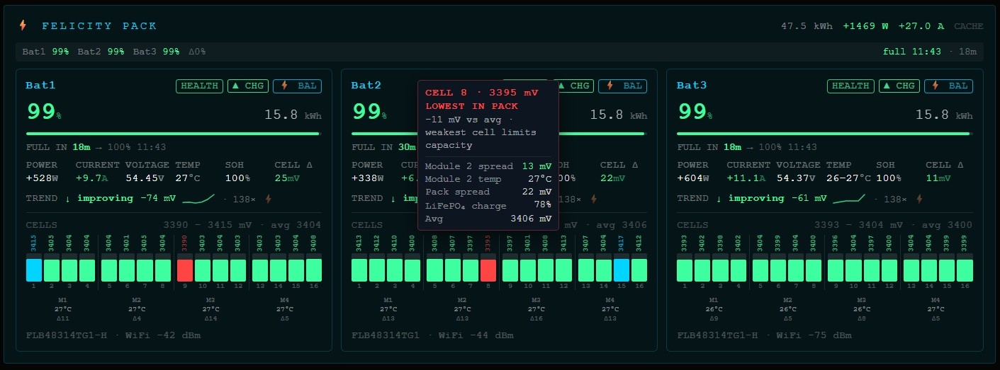
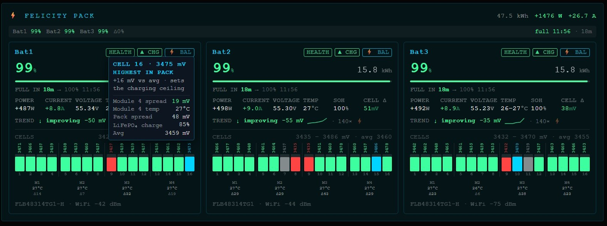
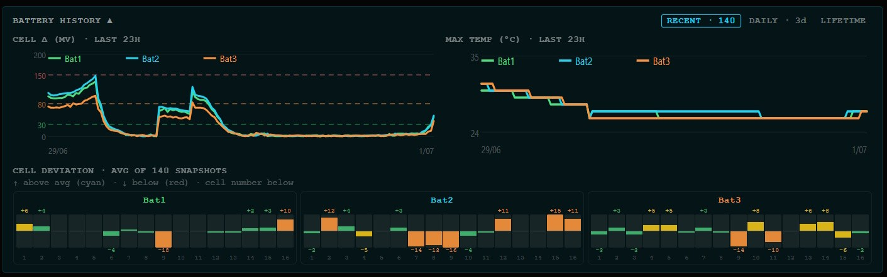
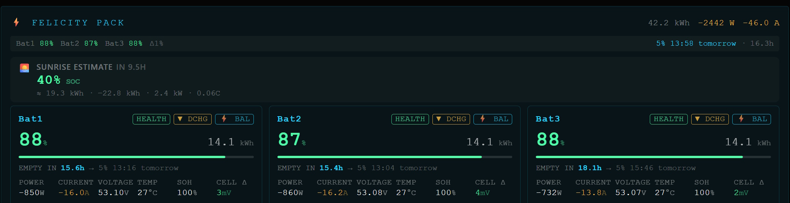

# mcp-fsolar

Live Felicity Solar battery data for Claude, REST APIs, Node.js apps, and event-driven pipelines — all from one package.

Connects to the [Felicity Solar](https://www.felicitysolar.com) cloud and exposes per-cell voltages, SOC, SOH, temperatures, BMS counters, balancing state, and computed health metrics.

## Usage modes

| Mode | When to use |
|---|---|
| [MCP server → Claude](#mcp-server--claude) | Ask Claude natural-language questions about your batteries |
| [Standalone REST API](#standalone-rest-api) | Query battery data over HTTP from any language or tool |
| [JS / TS library](#js--ts-library) | Embed directly in a Node.js or Next.js app — no separate server |
| [Event-driven](#event-driven-webhooks--emitter) | React to battery events (alerts, periodic snapshots) via webhooks or EventEmitter |

---

## MCP server → Claude

The same `fsolar-mcp` process serves both MCP and REST from one port.

### Claude Code (CLI)

Start the server manually, then register it:

```bash
npm install -g fsolar-mcp
FELICITY_USER=you@example.com FELICITY_PASS=yourpass fsolar-mcp
```

```bash
claude mcp add felicity --transport sse http://localhost:3010/sse
```

Or let Claude Code **auto-launch** it on demand — no separate terminal needed. Run once to register:

```bash
claude mcp add felicity \
  -e FELICITY_USER=you@example.com \
  -e FELICITY_PASS=yourpass \
  -- npx fsolar-mcp
```

> **Credentials tip:** the `-e KEY=val` flags appear in shell history. To avoid that, store credentials in `.env` and use the JSON config approach (Claude Desktop / Cursor sections below) — credentials stay in the config file, not the command line.

Claude Code launches a fresh `fsolar-mcp` process for each session (via stdio) and kills it when done. Each process starts its own poller, so `get_balance_trend` needs ~10 min of uptime before trend data is available.

Ask Claude things like *"what's the battery SOC?"*, *"is any cell imbalanced?"*, or *"show me the cell voltages for Bat2"*.

### Claude Desktop

Open Claude Desktop → Settings → Developer → Edit Config and add:

- **macOS**: `~/Library/Application Support/Claude/claude_desktop_config.json`
- **Windows**: `%APPDATA%\Claude\claude_desktop_config.json`

```json
{
  "mcpServers": {
    "felicity": {
      "command": "npx",
      "args": ["fsolar-mcp"],
      "env": {
        "FELICITY_USER": "your@example.com",
        "FELICITY_PASS": "yourpassword"
      }
    }
  }
}
```

Restart Claude Desktop — a hammer icon appears in the toolbar when the server is connected.

### Cursor

Add to `.cursor/mcp.json` in your project root (or the global `~/.cursor/mcp.json`):

```json
{
  "mcpServers": {
    "felicity": {
      "command": "npx",
      "args": ["fsolar-mcp"],
      "env": {
        "FELICITY_USER": "your@example.com",
        "FELICITY_PASS": "yourpassword"
      }
    }
  }
}
```

### Any MCP client (SSE transport)

Start the server, then point your client at the SSE endpoint:

```
http://localhost:3010/sse
```

The MCP message endpoint is `http://localhost:3010/messages?sessionId=<id>` (handled automatically by the SDK).

### MCP tools

| Tool | Description |
|---|---|
| `get_all_batteries` | Live status of all batteries — SOC, power, voltage, temperature, charging state |
| `get_battery` | Detailed status of one battery by alias (`Bat1`) or serial number |
| `get_cell_voltages` | Individual cell voltages (mV) — useful for detecting cell imbalance |
| `get_fleet_summary` | Compact health summary: total energy, worst cell delta, temperatures |
| `get_balance_trend` | Cell delta trend over the last ~60 min (improving / stable / degrading) |
| `get_snapshots` | Raw snapshots for the last ~60 min (one per ~10 min) |

---

## Standalone REST API

The same `fsolar-mcp` process exposes a plain HTTP API on the same port. No MCP client needed — any language or tool that can make HTTP requests works.

```bash
npm install -g fsolar-mcp
FELICITY_USER=you@example.com FELICITY_PASS=yourpass fsolar-mcp
```

### Endpoint reference

| Method | Path | Description |
|---|---|---|
| `GET` | `/batteries` | All batteries — SOC, power, voltage, temperature, charging state |
| `GET` | `/batteries/:id` | One battery by alias (`Bat1`) or serial number |
| `GET` | `/snapshots/intraday` | Download intraday snapshot store (JSON file) |
| `GET` | `/snapshots/daily` | Download daily snapshot store (JSON file) |
| `GET` | `/snapshots/state` | Download latest persisted state (JSON file) |
| `DELETE` | `/snapshots/intraday` | Clear intraday snapshot history |
| `DELETE` | `/snapshots/daily` | Clear daily snapshot history |
| `DELETE` | `/snapshots/all` | Clear all snapshot stores |
| `POST` | `/hooks` | Register a webhook URL |
| `GET` | `/hooks` | List registered webhooks |
| `DELETE` | `/hooks/:id` | Remove a webhook |
| `GET` | `/sse` | MCP SSE endpoint |

### Examples

```bash
# all batteries
curl http://localhost:3010/batteries

# one battery
curl http://localhost:3010/batteries/Bat1

# download snapshot history for analysis
curl http://localhost:3010/snapshots/intraday -o intraday.json
curl http://localhost:3010/snapshots/daily    -o daily.json

# register a webhook for all events
curl -X POST http://localhost:3010/hooks \
  -H 'Content-Type: application/json' \
  -d '{"url": "https://your-server.com/webhook"}'
```

**`GET /batteries` response shape:**

```json
{
  "batteries": [
    {
      "alias": "Bat1",
      "soc": 87,
      "soh": 98,
      "chargingState": "charging",
      "power": 1240,
      "voltage": 53.2,
      "current": 23.3,
      "cellDelta": 12,
      "tempMin": 28,
      "tempMax": 31,
      "remainingKwh": 8.7,
      "isBalancing": false,
      "cellVoltages": [3310, 3312, 3308, "…16 cells total"]
    }
  ],
  "fetchedAt": "2025-06-01T12:00:00.000Z",
  "fromCache": true,
  "pollError": null
}
```

**`GET /batteries/:id` response shape:**

```json
{
  "battery": { "…full battery object including modules…" },
  "fetchedAt": "2025-06-01T12:00:00.000Z",
  "fromCache": true
}
```

Pass `X-Last-Fetched-At: <ISO timestamp>` to bypass the cache when you already hold fresh data.

---

## JS / TS library

Import the client directly in your app — no separate server or network hop required. The library handles RSA login, token refresh, and caching internally.

```js
import { FelicityClient, MemoryCacheAdapter } from 'fsolar-mcp'

const client = new FelicityClient({
  user: process.env.FELICITY_USER,
  pass: process.env.FELICITY_PASS,
  cache: new MemoryCacheAdapter(),
  ttl: 30,  // cache TTL in seconds
})

const { batteries } = await client.getBatteries()
const { battery }   = await client.getBattery('Bat1')
```

To also start the background poller (keeps data fresh, enables snapshots and events):

```ts
import { FelicityClient, MemoryCacheAdapter, startPoller } from 'fsolar-mcp'

const client = new FelicityClient({ user, pass, cache: new MemoryCacheAdapter(), ttl: 30 })
startPoller(client)   // polls every FELICITY_POLL_MS (default 30 s)
```

TypeScript types are generated from source — the package ships `dist/index.d.ts` automatically. No separate `@types` package needed.

---

## TypeScript

The package is written in TypeScript. All types are exported from the package root:

```ts
import type {
  Battery, BatteryModule,
  BatteryHealth, AutonomyResult, AutonomyPerBattery, AutonomyOptions,
  BatterySnapshot, BalanceTrend,
  BatteriesResult, BatteryResult,
  FelicityClientOptions,
  MaterializedState,
  SnapshotPayload,
  CacheAdapter,
} from 'fsolar-mcp'

import { ChargingState, HealthStatus, TrendDirection, HookEvent } from 'fsolar-mcp'
```

### `Battery`

The core data object — one per physical battery pack. Returned inside `BatteriesResult` and `BatteryResult`.

```ts
interface Battery {
  // Identity
  sn:    string               // serial number
  alias: string               // human name (Bat1, Bat2, …)
  model: string               // model string from BMS
  status: "NM" | "AL" | "FL" | "OF"  // Normal / Alarm / Fault / Offline

  // State of charge / health
  soc: number                 // % state of charge
  soh: number                 // % state of health

  // Electrical
  voltage: number             // pack voltage (V)
  current: number             // pack current (A)
  power:   number             // pack power (W) — positive = charging, negative = discharging
  chargingState: ChargingState  // "charging" | "discharging" | "standby"

  // Energy
  remainingKwh:   number      // estimated remaining energy (kWh)
  capacityAh:     number      // rated capacity (Ah)
  ratedEnergyKwh: number | null  // rated energy (kWh) from BMS — null if not reported

  // Cell voltages (16 cells, mV)
  cellVoltages:   number[]
  cellVoltageMin: number | null
  cellVoltageMax: number | null
  cellDelta:      number | null  // spread max−min (mV) — primary imbalance indicator
  minCellNum:     number | null  // 1-based index of weakest cell
  maxCellNum:     number | null  // 1-based index of strongest cell

  // Temperature (°C) — 4 physical sensors; 3276.7 °C sentinel filtered out
  cellTemps: number[]
  tempMin:   number
  tempMax:   number

  // Module breakdown (4 modules × 4 cells)
  modules: BatteryModule[]

  // BMS protection limits
  chargeVoltLimit:    number | null  // max charge voltage (V)
  dischargeVoltLimit: number | null  // min discharge voltage (V)
  chargeCurrLimit:    number | null  // max charge current (A)
  dischargeCurrLimit: number | null  // max discharge current (A)

  // BMS lifecycle counters
  batCycleIndex:        number | null  // total charge cycles
  batFullCount:         number | null  // times reached full charge
  batUnderVoltageCount: number | null  // under-voltage events
  warningCount:         number

  // Metadata
  isBalancing:   boolean        // bit 6 of bmsState — BMS actively balancing cells
  bmsState:      number | null  // raw BMS state register
  dataTime:      string | null  // ISO timestamp of last Felicity API report
  reportFreqSec: number | null  // reporting interval (s)
  wifiSignal:    number         // dBm
}
```

### `BatteryModule`

One of the 4 modules inside a pack (each has 4 cells).

```ts
interface BatteryModule {
  index: number    // 1–4
  cells: number[]  // 4 cell voltages (mV)
  temp:  number | null  // physical sensor for this module (°C)
  min:   number    // lowest cell in this module (mV)
  max:   number    // highest cell in this module (mV)
  delta: number    // max − min spread within this module (mV)
}
```

### `BatteriesResult`

Returned by `client.getBatteries()`.

```ts
interface BatteriesResult {
  batteries: Battery[]
  fetchedAt: string                      // ISO timestamp of the fetch
  fromCache: boolean
  trend:     Record<string, BalanceTrend>  // keyed by serial number
}
```

### `BatteryResult`

Returned by `client.getBattery(id)`.

```ts
interface BatteryResult {
  battery:   Battery | null  // null when id not found
  fetchedAt: string
  fromCache: boolean
}
```

### `BatteryHealth`

Returned per battery by `computeHealth(batteries, snapshots)`. Keyed by serial number.

```ts
interface BatteryHealth {
  alias:           string
  cellDeltaStatus: "ok" | "warn" | "crit" | null  // null when cellDelta unavailable
  cellDelta:       number | null  // live spread (mV)
  dischargeDelta:  number | null  // median spread during discharge snapshots (mV) — more reliable than live
  tempStatus:      "ok" | "warn" | "crit" | null
  tempMax:         number | null
  sohStatus:       "ok" | "warn" | null  // SOH never reaches "crit"
  soh:             number | null
  outliers:        number[]    // 1-based cell indices persistently below pack average
  avgCRate:        number | null  // average C-rate over last ~6 snapshots
}
```

### `AutonomyResult`

Returned by `computeAutonomy(batteries, snapshots, opts)`.

```ts
interface AutonomyResult {
  totalRemainingKwh:     number       // sum of remainingKwh across all batteries
  totalCapacityKwh:      number       // sum of rated (or back-calculated) capacity
  dischargeRateKw:       number       // fleet rate used for all estimates
  estimatedHours:        number       // hours until fleet hits minSocPct
  estimatedHoursToFull:  number | null  // hours until fully charged; null if not charging
  estimatedSocAtSunrise: number | null  // % SOC at next sunrise; null if sunriseAt not given
  hoursToSunrise:        number | null
  estimatedDischargeKwh: number | null  // kWh discharged between now and sunrise
  estimatedRemainingKwh: number | null  // kWh remaining at sunrise
  perBattery:            AutonomyPerBattery[]
}

interface AutonomyPerBattery {
  sn:                   string
  alias:                string
  remainingKwh:         number
  estimatedHours:       number
  estimatedHoursToFull: number | null
}

interface AutonomyOptions {
  sunriseAt?:          string | Date | null  // ISO string or Date — enables sunrise fields
  packCapacityKwh?:    number | null         // explicit override; otherwise derived from BMS
  minSocPct?:          number                // reserve floor (default 5)
  defaultDischargeKw?: number                // fallback when no history (default 1.5)
}
```

### `BalanceTrend`

Returned by `snapshotStore.getTrend(sn)` and `snapshotStore.getAllTrends(batteries)`.

```ts
interface BalanceTrend {
  direction:              "improving" | "stable" | "degrading"
  deltaChange:            number    // mV change newest − oldest (negative = improving)
  history:                number[]  // cellDelta values oldest → newest
  balancingCount:         number    // snapshots where isBalancing = true
  snapshotCount:          number
  currentBalancingStreak: number    // consecutive trailing snapshots with balancing on
}
```

### `BatterySnapshot`

One entry in the snapshot store — written every `FELICITY_SNAPSHOT_MS` (default 10 min).

```ts
interface BatterySnapshot {
  ts:        string  // ISO timestamp
  batteries: Array<{
    sn:          string
    alias:       string
    soc:         number
    soh:         number
    power:       number
    cellDelta:   number | null
    cellMin:     number | null
    cellMax:     number | null
    maxCellNum:  number | null
    minCellNum:  number | null
    voltages:    number[]
    temps:       number[]
    tempMax:     number
    tempMin:     number
    isBalancing: boolean
    warningCount:   number
    batCycleIndex:  number | null
  }>
}
```

### `MaterializedState`

Returned by `readState()` — pre-computed state written by the poller on every tick. Zero-latency read; no recomputation needed.

```ts
interface MaterializedState {
  updatedAt: string                        // ISO timestamp of last poller tick
  batteries: Battery[]
  health:    Record<string, BatteryHealth>
  trend:     Record<string, BalanceTrend>
  autonomy:  AutonomyResult
}
```

### `SnapshotPayload`

Emitted by `snapshotEmitter` and delivered to `snapshot` webhook subscribers.

```ts
interface SnapshotPayload {
  batteries: Battery[]
  health:    Record<string, BatteryHealth>
  ts:        string  // ISO emission timestamp
}
```

### Enums

All discriminant strings are exported as frozen const objects — use them instead of bare strings for autocomplete and compile-time safety.

```ts
import { ChargingState, HealthStatus, TrendDirection, HookEvent } from 'fsolar-mcp'

// ChargingState
ChargingState.CHARGING    // "charging"
ChargingState.DISCHARGING // "discharging"
ChargingState.STANDBY     // "standby"

// HealthStatus
HealthStatus.OK    // "ok"
HealthStatus.WARN  // "warn"
HealthStatus.CRIT  // "crit"

// TrendDirection
TrendDirection.IMPROVING  // "improving"
TrendDirection.STABLE     // "stable"
TrendDirection.DEGRADING  // "degrading"

// HookEvent
HookEvent.CELL_DELTA_CRIT  // "cell_delta_crit"
HookEvent.CELL_DELTA_WARN  // "cell_delta_warn"
HookEvent.TEMP_CRIT        // "temp_crit"
HookEvent.TEMP_WARN        // "temp_warn"
HookEvent.SOH_WARN         // "soh_warn"
HookEvent.LOW_SOC          // "low_soc"
HookEvent.FULL             // "full"
HookEvent.ONLINE           // "online"
HookEvent.OFFLINE          // "offline"
HookEvent.SNAPSHOT         // "snapshot"
```

Types match their string values — `battery.chargingState === ChargingState.CHARGING` compiles and narrows correctly.

---

## Event-driven: webhooks & emitter

React to battery state changes without polling. Two delivery mechanisms — use one or both.

### HTTP webhooks

Register a URL to receive POST requests when events fire:

```
POST /hooks         body: { url, events? }   # register
GET  /hooks         # list registered hooks
DELETE /hooks/:id   # remove a hook
```

```bash
# receive all events
curl -X POST http://localhost:3010/hooks \
  -H 'Content-Type: application/json' \
  -d '{"url": "https://your-server.com/webhook"}'

# receive only critical cell alerts and periodic snapshots
curl -X POST http://localhost:3010/hooks \
  -H 'Content-Type: application/json' \
  -d '{"url": "https://your-server.com/webhook", "events": ["cell_delta_crit", "snapshot"]}'
```

### EventEmitter (same-process)

Subscribe directly in Node.js without an HTTP round-trip:

```js
import { startPoller, snapshotEmitter } from 'fsolar-mcp'

snapshotEmitter.on('snapshot', ({ batteries, health, ts }) => {
  // fires every FELICITY_TELEMETRY_MS (default 5 min)
  console.log(batteries[0].soc, health)
})

startPoller(client)
```

### Hook events

| Event | Trigger | Cooldown |
|---|---|---|
| `cell_delta_crit` | Cell delta ≥ 200 mV | 1 h |
| `cell_delta_warn` | Cell delta ≥ 120 mV | 4 h |
| `temp_crit` | tempMax ≥ 50 °C | 1 h |
| `temp_warn` | tempMax ≥ 40 °C | 4 h |
| `soh_warn` | SOH < 90 % | 24 h |
| `low_soc` | SOC ≤ `FELICITY_LOW_SOC_PCT` % (default 20) _(reserved)_ | 2 h |
| `full` | SOC reaches 100 % _(reserved)_ | 8 h |
| `online` | Battery comes online _(reserved)_ | 1 h |
| `offline` | Battery goes offline _(reserved)_ | 1 h |
| `snapshot` | Time-based (every `FELICITY_TELEMETRY_MS`) | none |

Thresholds match `computeHealth` constants (`HEALTH_CELL_DELTA_CRIT`, `HEALTH_TEMP_WARN`, etc. — see [docs/ALGORITHMS.md](./docs/ALGORITHMS.md)). Events marked _reserved_ are defined but not yet fired by the poller.

---

## Configuration

| Variable | Required | Default | Description |
|---|---|---|---|
| `FELICITY_USER` | Yes | — | Felicity Solar account email |
| `FELICITY_PASS` | Yes | — | Felicity Solar account password |
| `FELICITY_PORT` | No | `3010` | HTTP server port |
| `FELICITY_API_KEY` | No | — | If set, all REST requests must supply `Authorization: Bearer <key>` or `X-API-Key: <key>` |
| `FELICITY_CORS_ORIGIN` | No | localhost origins only | Allowed CORS origin. Set to `*` to open fully, or an explicit origin to lock down |
| `FELICITY_RATE_LIMIT` | No | `60` | Max REST requests per minute per IP. Set to `0` to disable |
| `FELICITY_POLL_MS` | No | `30000` | Felicity API poll interval (ms) |
| `FELICITY_TOKEN_TTL_H` | No | `6` | Felicity auth token lifetime in hours before proactive refresh |
| `FELICITY_LOW_SOC_PCT` | No | `20` | SOC % threshold that triggers the `low_soc` webhook event |
| `FELICITY_TARIFF_KWH` | No | — | Electricity tariff in currency/kWh used by the `get_cost_savings` MCP tool |
| `FELICITY_TELEMETRY_MS` | No | `300000` | Snapshot emitter / webhook interval (ms) |
| `FELICITY_SNAPSHOT_ENABLED` | No | `true` | Enable background snapshot store |
| `FELICITY_SNAPSHOT_MS` | No | `600000` | Snapshot store interval (ms, min 60 000) |
| `FELICITY_SNAPSHOT_DAYS` | No | `3` | Intra-day snapshot retention (days) |
| `FELICITY_DAILY_DAYS` | No | `90` | Daily snapshot retention (days) |
| `SNAPSHOT_DIR` | No | `os.tmpdir()` | Directory for snapshot JSON files (`battery-snapshots.json`, `battery-daily.json`, `battery-state.json`) |

---

## What you can build

**Real-time fleet view** — per-cell voltages, SOC, power flow, SOH, balancing state and temperature for every battery in the pack.



**Cell-level inspection** — voltage, deviation from pack average, module spread, LiFePO4 charge %, weakest/strongest cell.



**Historical trends** — cell-delta and temperature over the last 24 h, per-cell deviation heatmap, daily SOH trend, lifetime cycle-count with projected remaining battery life.



**Discharging view** — live power flow and SOC during active discharge across the fleet.



---

## Algorithms & metrics

Formulas, thresholds, hook event conditions, and snapshot behaviour: [docs/ALGORITHMS.md](./docs/ALGORITHMS.md).

## How it works

The Felicity cloud API requires passwords to be RSA-encrypted (public key extracted from the Android APK). The client handles login, token refresh, and caching automatically. A background poller keeps data fresh so MCP tool calls and REST requests are instant.

## Setup from source

```bash
git clone https://github.com/RicardoSantos/mcp-fsolar
cd mcp-fsolar
npm install
npm run build          # compile TypeScript → dist/
cp .env.example .env   # fill in your credentials
node dist/server.js
```

```bash
node probe.js          # dump raw API responses for every device
```

## License

MIT
